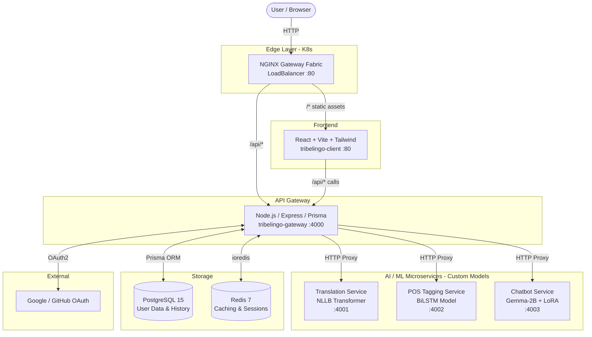
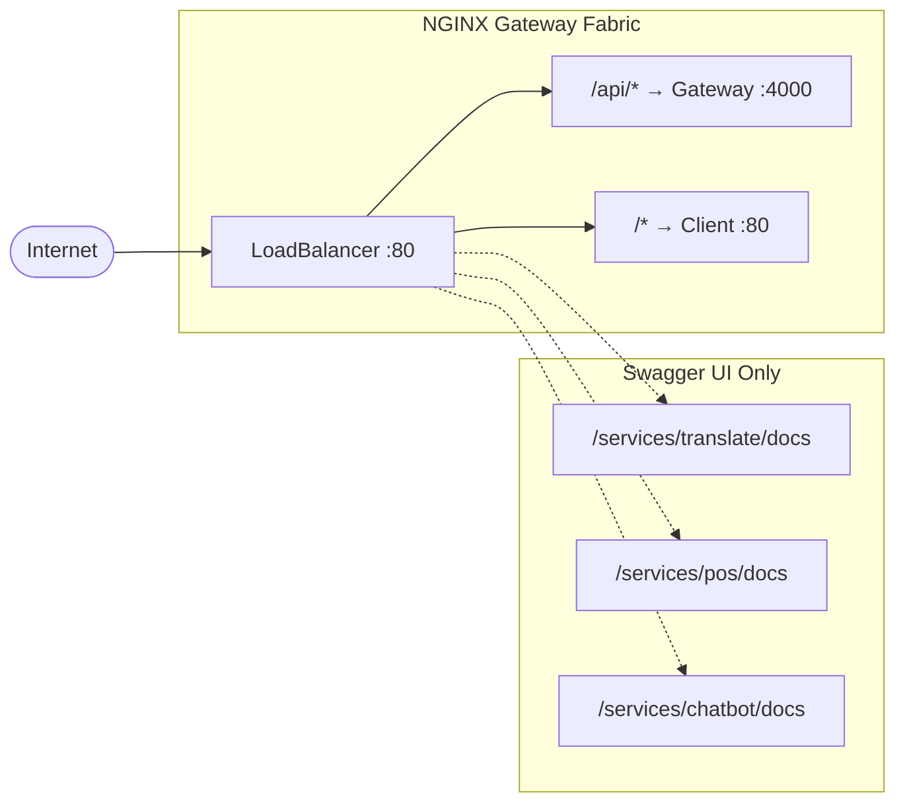

# TribeLingo

> AI-powered Kokborok language platform — Translation, Morphological Analysis (POS), and Conversational AI Chatbot.

TribeLingo is a microservices-based system designed to preserve and promote the **Kokborok (Tripuri)** language, a Tibeto-Burman language spoken in Tripura, India. It provides:

- **Machine Translation** — NLLB (No Language Left Behind) transformer model, fine-tuned on a custom Kokborok–English parallel corpus
- **Morphological POS Tagging** — BiLSTM (Bidirectional Long Short-Term Memory) model, custom-trained for Kokborok morphological segmentation and UPOS tagging
- **Conversational Chatbot** — Gemma-2B-it model fine-tuned with LoRA (Low-Rank Adaptation) on a curated Kokborok language & culture dataset

All models are trained and fine-tuned on a **custom Kokborok dataset** — all served behind a unified microservices API gateway.

---

## System Architecture



### Services

| Service | Tech Stack | Port | DockerHub Image |
|---|---|---|---|
| **Client** | React 18, Vite, Tailwind CSS, Nginx | 80 | `sk963/tribelingo-client` |
| **Gateway** | Node.js, Express 5, Prisma, Zod | 4000 | `sk963/tribelingo-gateway` |
| **Translate** | Node.js, NLLB Transformer (custom fine-tuned) | 4001 | `sk963/tribelingo-translate` |
| **POS** | Python 3, FastAPI, BiLSTM (custom-trained) | 4002 | `sk963/tribelingo-pos` |
| **Chatbot** | Python 3, FastAPI, Gemma-2B + LoRA (fine-tuned) | 4003 | `sk963/tribelingo-chatbot` |
| **PostgreSQL** | PostgreSQL 15/16 | 5432 | `postgres:15-alpine` |
| **Redis** | Redis 7 Alpine | 6379 | `redis:7-alpine` |

---

## Project Structure

```
TribeLingo/
├── client/v2/              React + Vite frontend
│   ├── src/app/
│   │   ├── pages/          LandingPage, SignUpPage, DictionaryPage
│   │   ├── hooks/          useTranslation, useAuth
│   │   └── context/        TranslatorFormContext, AuthContext
│   ├── nginx.conf          Nginx SPA config
│   └── Dockerfile
├── gateway/v1/             Express.js API Gateway
│   ├── src/modules/        auth, translation, pos, chatbot, saved, dictionary, docs
│   ├── prisma/schema.prisma
│   └── Dockerfile
├── translate/v2/           Translation microservice
│   ├── src/app.ts          Express + NLLB model integration + Swagger
│   └── Dockerfile
├── pos/v2/                 POS Tagging microservice
│   ├── main.py             FastAPI + BiLSTM morphological analyzer
│   ├── instruction.md      Kokborok linguistic rules & analysis prompt
│   └── Dockerfile
├── chatbot/v2/             Chatbot microservice
│   ├── main.py             FastAPI + Fine-tuned Gemma-2B chatbot
│   └── Dockerfile
├── k8s/                    Kubernetes manifests + setup/cleanup scripts
├── docs/
│   ├── hld.md              High-Level Design document
│   └── lld.md              Low-Level Design document
├── docker-compose.yml              Infrastructure (Postgres + Redis)
├── docker-compose-services.yaml    Application services (DockerHub images)
└── self-setup.md           Guide for running the project on your own
```

---

## Documentation

> **For a comprehensive understanding of the system, refer to these documents:**

| Document | What's Inside |
|---|---|
| **[docs/hld.md](docs/hld.md)** | System context, container architecture, bounded contexts, business flow sequence diagrams (translation, chatbot, OAuth), Kubernetes deployment topology, security architecture |
| **[docs/lld.md](docs/lld.md)** | Code-level service map, gateway routing tables, module internal wiring diagrams, full database ERD (9 Prisma models), detailed sequence diagrams, complete API endpoint specifications, environment variable reference |
| **[self-setup.md](self-setup.md)** | Step-by-step guide for setting up cloud credentials, OAuth apps, and running the full project on your own infrastructure |

---

## Running the Project

### Prerequisites

- **Docker** & **Docker Compose** (required for all options)
- **Node.js** ≥ 20 (for local development)
- **Python** ≥ 3.10 (for local development)
- **Cloud credentials** service account key (`key.json`) for model inference — see [self-setup.md](self-setup.md)

---

### Option 1: Run Each Service Individually (Development)

Best for active development with hot-reload.

**Step 1 — Start infrastructure:**

```bash
docker compose up -d          # Starts Postgres + Redis
```

**Step 2 — Start each service in a separate terminal:**

```bash
# Terminal 1: Gateway
cd gateway/v1
cp .env.example .env          # Edit DATABASE_URL, REDIS_URL, JWT_SECRET
npm install
npx prisma generate && npx prisma migrate dev
npm run dev                   # → http://localhost:4000

# Terminal 2: Translate
cd translate/v2
cp .env.example .env          # Set PROJECT_ID and CREDENTIALS
npm install
npm run dev                   # → http://localhost:4001

# Terminal 3: POS Tagger
cd pos/v2
python -m venv .venv && source .venv/bin/activate
pip install -r requirements.txt
uvicorn main:app --reload --host 0.0.0.0 --port 4002   # → http://localhost:4002

# Terminal 4: Chatbot
cd chatbot/v2
python -m venv .venv && source .venv/bin/activate
pip install -r requirements.txt
uvicorn main:app --reload --host 0.0.0.0 --port 4003   # → http://localhost:4003

# Terminal 5: Client
cd client/v2
cp .env.example .env
npm install
npm run dev                   # → http://localhost:5173
```

**Step 3 — Stop everything:**

```bash
docker compose down           # Stops Postgres + Redis
```

---

### Option 2: Docker Compose — Full Stack with DockerHub Images

Best for quick testing — runs all services using pre-built images from DockerHub.

**Step 1 — Start infrastructure (Postgres + Redis):**

```bash
docker compose up -d
```

**Step 2 — Start all application services:**

```bash
docker compose -f docker-compose-services.yaml up -d
```

This will:
1. Run **Prisma migrations** against Postgres (via the gateway image)
2. Start **Translate**, **POS**, **Chatbot**, **Gateway**, and **Client** containers
3. Gateway connects to Postgres/Redis on the host via `host.docker.internal`

| Service | URL |
|---|---|
| Frontend | http://localhost |
| Gateway API Docs | http://localhost:4000/api/docs |
| Translate Swagger | http://localhost:4001/docs |
| POS Swagger | http://localhost:4002/docs |
| Chatbot Swagger | http://localhost:4003/docs |

**Step 3 — Stop everything:**

```bash
docker compose -f docker-compose-services.yaml down   # Stop services
docker compose down                                     # Stop infra
# Add -v flag to also wipe database volumes
```

> **Note:** The `key.json` credential files must be present at `translate/v2/key.json`, `pos/v2/key.json`, and `chatbot/v2/key.json`. See [self-setup.md](self-setup.md) for setup instructions.

---

### Option 3: Kubernetes Deployment (Production)

Deploy to a Kubernetes cluster using NGINX Gateway Fabric (Gateway API).

```bash
export KUBECONFIG=./k8s/lke-kubeconfig.yaml
cd k8s
chmod +x setup.sh cleanup.sh
./setup.sh
```

The `setup.sh` script:
1. Installs **Gateway API CRDs** + **NGINX Gateway Fabric** via Helm
2. Deploys **PostgreSQL** and **Redis** StatefulSets with persistent storage
3. Runs **Prisma database migrations** (one-shot Job)
4. Deploys all **application services**
5. Creates **HTTPRoute rules** for path-based traffic routing



> **Note:** The `/services/*` routes are for **Swagger UI documentation only** — the React client never calls these paths directly. All application API calls go through `/api/*` → Gateway → downstream services.

**Production Swagger UI Endpoints:**

| Service | URL |
|---|---|
| Gateway API Docs | `http://<LB_IP>/api/docs` |
| Translate Docs | `http://<LB_IP>/services/translate/docs` |
| POS Tagger Docs | `http://<LB_IP>/services/pos/docs` |
| Chatbot Docs | `http://<LB_IP>/services/chatbot/docs` |

**Teardown:**

```bash
cd k8s && ./cleanup.sh
```

> **For K8s configuration details** (secrets, configmaps, env vars), refer to **[docs/lld.md](docs/lld.md)** Section 8.

---

## API Endpoints (Quick Reference)

| Method | Path | Auth | Description |
|---|---|---|---|
| `POST` | `/api/auth/signup` | ✗ | Local registration |
| `POST` | `/api/auth/login` | ✗ | Local login |
| `POST` | `/api/auth/google` | ✗ | Google OAuth |
| `POST` | `/api/translation/direct` | ✗ | Translate + POS (no auth) |
| `POST` | `/api/translation` | ✓ | Translate + POS + save history |
| `GET` | `/api/translation/history` | ✓ | Get translation history |
| `POST` | `/api/pos` | ✗ | POS morphological analysis |
| `POST` | `/api/chat` | ✗ | Chatbot conversation |
| `GET` | `/api/dictionary/search?q=` | ✗ | Dictionary lookup |
| `GET` | `/healthz` | ✗ | Gateway health check |

> **Full API specification** with request/response schemas is in **[docs/lld.md](docs/lld.md)** Section 7.

---

## AI / ML Models

| Model | Architecture | Training | Use Case |
|---|---|---|---|
| **Translation** | NLLB (No Language Left Behind) | Fine-tuned on custom Kokborok–English parallel corpus | Bidirectional English ↔ Kokborok translation |
| **POS Tagger** | BiLSTM (Bidirectional Long Short-Term Memory) | Custom-trained on annotated Kokborok morphological dataset | Morpheme segmentation, root extraction, UPOS tagging |
| **Chatbot** | Gemma-2B-it + LoRA (Low-Rank Adaptation) | Fine-tuned on curated Kokborok language & culture Q&A dataset | Tri-lingual conversational AI (Kokborok, Bengali, English) |

### Dataset

The custom Kokborok dataset used for training all models was provided by **Enjula Uchoi**, NLP subject faculty, who is part of the **Google Low-Resource Language Translation Program**. He, along with his research team, has developed this exhaustive dataset covering parallel translations, morphological annotations, and conversational data for the Kokborok language.

### Research Publications

Research papers based on this work have been accepted at the following international conferences:

| Conference | Status |
|---|---|
| **ICIDSSD 2026** — International Conference on Interdisciplinary Digital Solutions for Sustainable Development | ✅ Accepted |
| **Micro2026** — International Conference on Microelectronics, Computing & Communication Systems (ACTSoft) | ✅ Accepted |
| **ICCMSE 2026** — International Conference on Computational Methods and Sustainable Engineering | ✅ Accepted |

---


# app
Frontend UI

Main App: https://tribelingo.onrender.com/  

📖 Swagger API Documentation  
Gateway API Docs: https://tribelingo-gateway.onrender.com/api/docs/ (Main orchestrator API)  
Translate Docs: https://tribelingo-translate.onrender.com/docs/ (NLLB Translation Model)  
MA Tagger Docs: https://tribelingo-ma.onrender.com/docs (BiLSTM Morphological Analysis)  
Chatbot Docs:  comming soon (Gemma-2B AI Assistant)  

## License

This project was developed as a capstone project for Kokborok language preservation.


